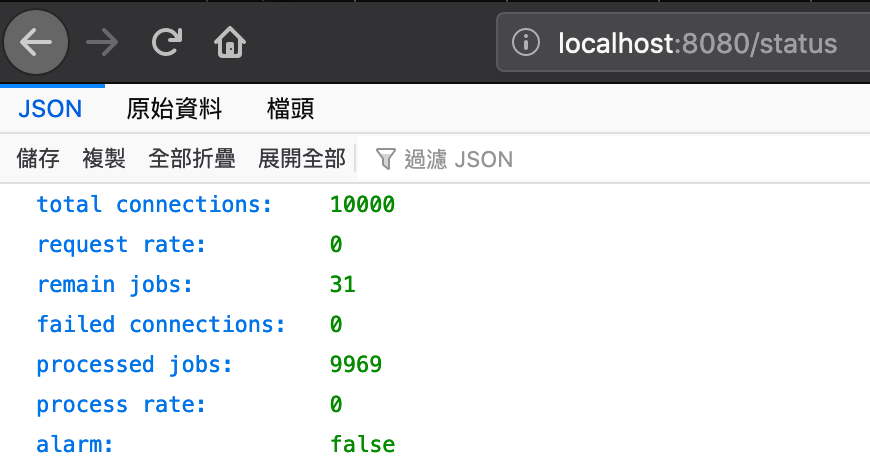

<p align="center">

</p>

# Orinex for API Enpoint Protection

Orinex is a Proxy Server for API Enpoint Protection. 

Use Orinex to:

- Traffic splitting  
- Tiny Load Balancing feature 

## How to Using it

launch mock-server which open 3000 for http protocol

```go
cd mock_server
go run mock_server.go
curl http://localhost:8080/status
```

launch orinex which open 8000 for tcp and 8080 for http protocol

```go
cd orinex
go get github.com/shirou/gopsutil/cpu
go run .
```

launch client
```go
go test -args "c 1 m helloworld"
```

check status in realtime

<p align="left">

</p>